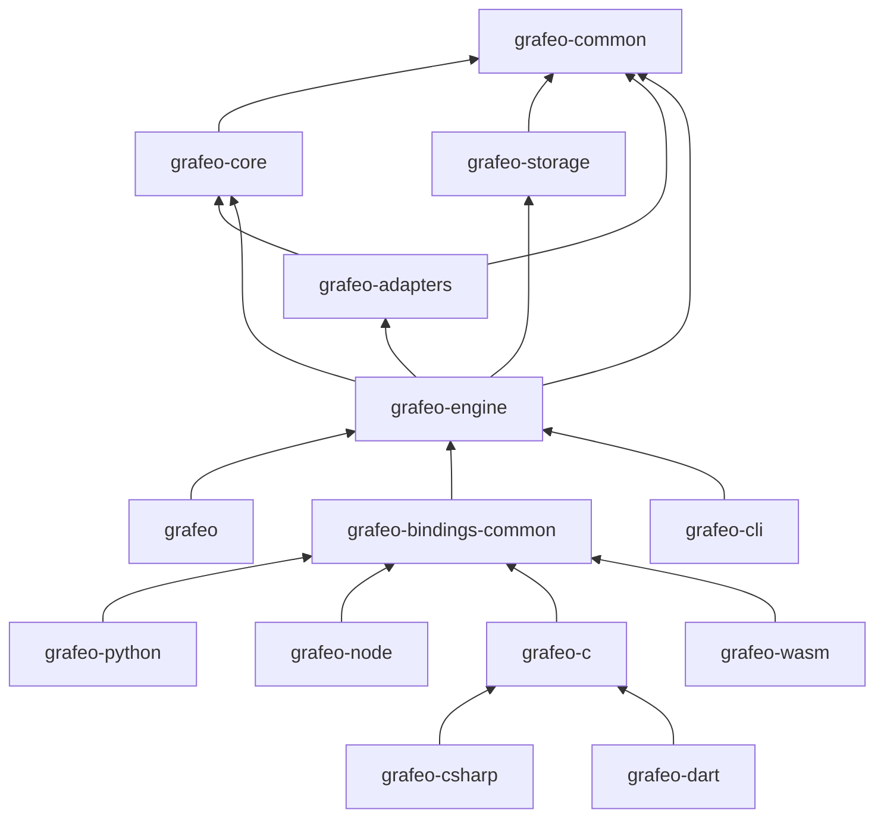

# Crate Structure

Grafeo is organized into core library crates and language binding crates.

## Dependency Graph



## grafeo

Top-level facade crate that re-exports the public API.

| Module | Purpose |
|--------|---------|
| `lib.rs` | Re-exports from grafeo-engine |

```rust
use grafeo::GrafeoDB;

let db = GrafeoDB::new_in_memory();
```

## grafeo-common

Foundation types and utilities.

| Module | Purpose |
|--------|---------|
| `types/` | NodeId, EdgeId, Value, LogicalType |
| `memory/` | Arena allocator, memory pools |
| `utils/` | Hashing, error types |

```rust
use grafeo_common::types::{NodeId, Value};
use grafeo_common::memory::Arena;
```

## grafeo-core

Core data structures and execution engine.

| Module | Purpose |
|--------|---------|
| `graph/lpg/` | LPG storage (nodes, edges, properties) |
| `index/` | Hash, B-tree, adjacency indexes |
| `execution/` | DataChunk, operators, pipelines |

```rust
use grafeo_core::graph::LpgStore;
use grafeo_core::index::HashIndex;
use grafeo_core::execution::DataChunk;
```

## grafeo-storage

Persistence I/O: section-based `.grafeo` container format, WAL management and crash safety. Sibling to `grafeo-core` (both depend only on `grafeo-common`, not on each other).

| Module | Purpose |
|--------|---------|
| `container/` | Section-based `.grafeo` file format with checksummed, independently addressable sections |
| `wal/` | Write-ahead log: append, replay, truncation, backup cursor |
| `mmap/` | Memory-mapped section reads via `memmap2` |

```rust
use grafeo_storage::container::Container;
use grafeo_storage::wal::WalManager;
```

## grafeo-adapters

Query language parsers and external interfaces.

| Module | Purpose |
|--------|---------|
| `query/gql/` | GQL parser (lexer, parser, AST) |
| `query/cypher/` | Cypher compatibility layer |
| `query/sparql/` | SPARQL parser |
| `query/gremlin/` | Gremlin parser |
| `query/graphql/` | GraphQL parser |
| `query/sql_pgq/` | SQL/PGQ parser |
| `plugins/` | Plugin system |

```rust
use grafeo_adapters::query::gql::Parser;
```

## grafeo-engine

Database facade and coordination.

| Module | Purpose |
|--------|---------|
| `database.rs` | GrafeoDB struct, lifecycle |
| `session.rs` | Session management |
| `query/` | Query processor, planner, optimizer |
| `transaction/` | Transaction manager, MVCC |

```rust
use grafeo_engine::{GrafeoDB, Session, Config};
```

## grafeo-python

Python bindings via PyO3. Located at `crates/bindings/python`.

| Module | Purpose |
|--------|---------|
| `database.rs` | PyGrafeoDB class |
| `query.rs` | Query execution |
| `types.rs` | Type conversions |

```python
import grafeo
db = grafeo.GrafeoDB()
```

## grafeo-node

Node.js/TypeScript bindings via napi-rs. Located at `crates/bindings/node`.

| Module | Purpose |
|--------|---------|
| `database.rs` | JsGrafeoDB class |
| `query.rs` | Query execution and result conversion |
| `types.rs` | JavaScript ↔ Rust type conversions |

```javascript
const { GrafeoDB } = require('@grafeo-db/js');
const db = await GrafeoDB.create();
```

## grafeo-c

C FFI layer for cross-language interop. Located at `crates/bindings/c`.

| Module | Purpose |
|--------|---------|
| `lib.rs` | C-compatible function exports |
| `types.rs` | C-safe type wrappers |

Also used by Go (CGO), C# (P/Invoke) and Dart (dart:ffi) bindings.

## grafeo-csharp

C# / .NET 8 bindings via source-generated P/Invoke. Located at `crates/bindings/csharp`.

Wraps grafeo-c with a .NET-native API including `GrafeoDB`, typed CRUD, transactions, vector search and `SafeHandle`-based resource management.

## grafeo-dart

Dart bindings via dart:ffi. Located at `crates/bindings/dart`.

Wraps grafeo-c with `NativeFinalizer` for automatic resource cleanup, sealed exception hierarchy and `late final` cached FFI lookups.

## grafeo-bindings-common

Shared library for all language bindings. Located at `crates/bindings/common`.

| Module | Purpose |
|--------|---------|
| `entities.rs` | Entity extraction (RawNode, RawEdge) |
| `errors.rs` | Error classification |
| `json.rs` | JSON to/from Value conversion |

## grafeo-wasm

WebAssembly bindings via wasm-bindgen. Located at `crates/bindings/wasm`.

| Module | Purpose |
|--------|---------|
| `lib.rs` | WASM-compatible database API |
| `types.rs` | JavaScript ↔ WASM type conversions |

```javascript
import init, { Database } from '@grafeo-db/wasm';
await init();
const db = new Database();
```

## grafeo-cli

Command-line interface for database administration.

| Module | Purpose |
|--------|---------|
| `commands/` | CLI command implementations |
| `output.rs` | Output formatting (table, JSON) |

```bash
grafeo info ./mydb
grafeo stats ./mydb --format json
```

## Crate Guidelines

1. **No cyclic dependencies** - Strict layering
2. **Public API minimization** - Only expose what's needed
3. **Feature flags** - Optional functionality gated by features
4. **Documentation** - All public items documented
