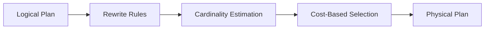

# Query Optimization

Grafeo uses cost-based optimization to select efficient query plans.

## Optimizer Pipeline



## Cost Model

The cost model estimates execution cost for plan selection.

| Component | Weight | Description |
| --------- | ------ | ----------- |
| CPU | 1.0 | Computation cost |
| I/O | 10.0 | Disk access cost |
| Memory | 0.5 | Memory allocation |

```text
Total Cost = CPU_cost * cpu_weight
           + IO_cost * io_weight
           + Mem_cost * mem_weight
```

| Operator | Cost Formula |
| -------- | ------------ |
| Scan | rows * column_count |
| Filter | input_rows * selectivity |
| Hash Join | build_rows + probe_rows |
| Sort | rows * log(rows) |

The cost model uses real fanout derived from graph statistics (average degree, label cardinalities, edge-type frequencies) instead of hardcoded defaults. This leads to better plan selection for traversal-heavy queries, especially on graphs with skewed degree distributions.

## Cardinality Estimation

Accurate cardinality estimation is crucial for plan selection.

| Statistic | Purpose |
| --------- | ------- |
| Element count | Base cardinality (nodes/edges per label) |
| Distinct count | Join estimation |
| Histograms | Range selectivity |
| Null fraction | Null handling |

```text
// Equality predicate
selectivity = 1 / distinct_count

// Range predicate
selectivity = (high - low) / (max - min)

// Join
output_rows = (rows_a * rows_b) / max(distinct_a, distinct_b)
```

Statistics are collected automatically by the query engine during graph operations. Grafeo tracks per-label and per-property statistics for cardinality estimation.

## Join Ordering (DPccp)

Graph pattern matching translates to multi-way joins (one per edge in the pattern). DPccp (Dynamic Programming connected complement pairs) efficiently enumerates only connected subgraph pairs, pruning the exponential search space while guaranteeing an optimal join order. Greedy algorithms miss better plans; exhaustive DP is too slow for large patterns. DPccp hits the sweet spot.

For n relations, the number of possible join orders grows explosively:

| Relations | Possible Orders |
| --------- | --------------- |
| 3 | 12 |
| 5 | 1,680 |
| 10 | ~17 billion |

DPccp works by:

1. Enumerating all connected subgraphs
2. Finding the optimal join for each subgraph
3. Building larger plans from smaller optimal plans
4. Pruning dominated plans

### Join Type Selection

| Join Type | Best When |
| --------- | --------- |
| Hash Join | Large inputs, equality predicates |
| Nested Loop | Small inner, indexed |
| Merge Join | Sorted inputs |

## RDF Query Optimization

SPARQL queries over the RDF triple store use a specialized optimization path built on per-predicate statistics and, when available, the [Ring Index](../storage/ring-index.md).

### RDF Statistics

The `RdfStatistics` collector iterates all triples to compute:

| Statistic | Scope | Purpose |
| --------- | ----- | ------- |
| Total triples | Store-wide | Base cardinality for unbound patterns |
| Subject/predicate/object counts | Store-wide | Domain sizes for join selectivity |
| Per-predicate triple count | Per predicate | Cardinality of `?s :pred ?o` patterns |
| Distinct subjects per predicate | Per predicate | Fan-in estimation |
| Distinct objects per predicate | Per predicate | Fan-out estimation |
| Functional / inverse-functional flags | Per predicate | Detects 1:1 and N:1 relationships |
| Object type distribution | Per predicate | Type-aware selectivity |
| Subject and object histograms | Store-wide | Range and filter selectivity |

### Statistics Caching

Computing statistics requires a full scan of the triple store, which is expensive for large datasets. Grafeo caches the result behind `get_or_collect_statistics()`:

1. **Fast path:** if a cached `Arc<RdfStatistics>` exists, return it immediately (read lock only)
2. **Slow path:** compute statistics, store in cache, return
3. **Invalidation:** any mutation (insert, delete, bulk load) clears the cache

This ensures that a burst of read queries pays the collection cost at most once.

### Triple Pattern Cardinality

The optimizer estimates how many triples each pattern will produce:

```text
Pattern             Estimate
------------------------------------------------------------
?s ?p ?o            total_triples (full scan)
<alix> ?p ?o        total_triples / subject_count
?s <knows> ?o       predicate_stats.triple_count
?s ?p <gus>         total_triples / object_count
<alix> <knows> ?o   predicate_stats.avg_objects_per_subject
?s <knows> <gus>    predicate_stats.avg_subjects_per_object
<alix> ?p <gus>     predicate_count (rare pattern)
<alix> <knows> <gus> 1.0 (existence check)
```

Join selectivity between two patterns sharing a variable is estimated as `1 / domain_size`, where the domain is the number of distinct values for the shared variable's position (subject, predicate, or object).

### Ring Index Integration

When the `ring-index` feature is enabled, the planner replaces statistical estimates with exact counts from the Ring's wavelet trees. This changes cardinality estimation from an approximation to a precise lookup in O(log sigma) time:

```text
// Statistical estimate: 10.0 (default for unknown predicates)
// Ring exact count:     847  (wavelet tree rank operation)
```

Exact counts improve join ordering decisions, especially when predicates have highly skewed cardinalities that statistical defaults cannot capture.

### Cost-Based Join Reordering

For multi-way joins (queries with multiple triple patterns), the planner:

1. Estimates cardinality for each pattern (via Ring counts or statistics)
2. Sorts patterns by ascending cardinality
3. Folds left-to-right with pairwise hash joins, building on the smallest intermediate results first

When the Ring Index is available and all patterns are simple triple scans without `LANG()` / `DATATYPE()` dependencies, the planner upgrades to a leapfrog worst-case optimal join (WCOJ) that intersects sorted streams directly without materializing intermediates.

### Dictionary Encoding

The Ring Index's term dictionary maps every unique RDF term to a 32-bit integer ID. This provides compact in-memory representation during query execution: wavelet tree operations work on integer IDs rather than variable-length strings, and term resolution back to strings happens only at the result boundary.
