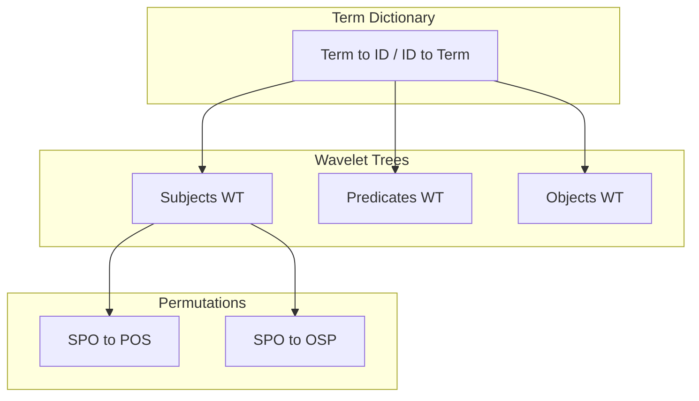

# Ring Index

The Ring Index is a compact representation for RDF triples that achieves approximately 3x space reduction compared to traditional hash-based triple indexing. It is inspired by the Ring data structure described by Alvarez-Garcia et al. for compressed RDF management, adapted for Grafeo's embeddable architecture.

**Feature flag:** `ring-index`

## Motivation

Traditional RDF stores maintain three separate hash indexes (SPO, POS, OSP) so that any triple pattern can be answered efficiently. This triplicates the storage cost. The Ring Index stores triples once and uses wavelet trees with succinct permutations to navigate between orderings, eliminating the redundancy.

| Approach | Size (1M triples) |
| -------- | ------------------ |
| 3 HashMaps | ~120 MB |
| Ring Index | ~40 MB |
| **Savings** | **~3x** |

## Architecture



### Term Dictionary

All RDF terms (IRIs, literals, blank nodes) are mapped to compact 32-bit integer IDs through a bidirectional dictionary. This dictionary is shared across all three components, so each unique term is stored exactly once.

```text
Term                          ID
<http://ex.org/alix>     -->  0
<http://xmlns.com/foaf/0.1/knows> --> 1
<http://ex.org/gus>      -->  2
"Alix"                   -->  3
```

### Wavelet Trees

Triples are sorted in SPO (subject, predicate, object) order. Three parallel wavelet trees store the subject, predicate, and object ID sequences respectively. Wavelet trees support two key operations in O(log sigma) time, where sigma is the alphabet size (number of distinct terms):

- **rank(v, i):** count occurrences of value v up to position i
- **select(v, k):** find the position of the k-th occurrence of value v

These operations enable efficient counting and lookup for any single-component pattern without scanning the full dataset.

### Succinct Permutations

Two permutations map positions between triple orderings:

- **SPO to POS:** maps a position in subject-predicate-object order to its position in predicate-object-subject order
- **SPO to OSP:** maps a position in subject-predicate-object order to its position in object-subject-predicate order

Each permutation stores both forward and inverse mappings for O(1) access, using 8n bytes for n triples. Together with the wavelet trees, this allows answering queries in any ordering without duplicating triple data.

## Query Patterns

The Ring Index supports all eight triple patterns:

| Pattern | Bound | Method |
| ------- | ----- | ------ |
| `???` | None | Return total count or iterate all |
| `S??` | Subject | Wavelet tree rank/select on subjects |
| `?P?` | Predicate | Wavelet tree rank/select on predicates |
| `??O` | Object | Wavelet tree rank/select on objects |
| `SP?` | Subject + Predicate | Find S positions, check P at each |
| `S?O` | Subject + Object | Find S positions, check O at each |
| `?PO` | Predicate + Object | Find P positions, check O at each |
| `SPO` | All | Exact match check |

Single-component patterns (S??, ?P?, ??O) are answered directly by wavelet tree `count()` in O(log sigma) time. The fully unbound pattern returns the stored triple count in O(1).

## Leapfrog Joins (WCOJ)

For SPARQL queries with multiple triple patterns sharing variables (star joins), the Ring Index supports leapfrog worst-case optimal joins (WCOJ). Instead of materializing intermediate results through pairwise hash joins, leapfrog iteration intersects sorted iterator streams directly.

### How It Works

Consider a query like:

```sparql
SELECT ?person ?name ?friend WHERE {
  ?person :name ?name .
  ?person :knows ?friend .
}
```

This is a star join on `?person`. The leapfrog join:

1. Creates a `RingIterator` for each triple pattern, bound on the shared variable
2. Advances all iterators in lockstep, seeking to the next value that satisfies all patterns simultaneously
3. For each match, reconstructs the full variable bindings

The time complexity is O(n * log sigma) where n is the output size, rather than O(n1 * n2) for a pairwise hash join. This is particularly beneficial for queries with high fan-out predicates or many-way star joins.

### When the Planner Uses Leapfrog

The RDF query planner (`plan_multi_way_join`) attempts the leapfrog path when:

1. The `ring-index` feature is enabled
2. A Ring Index has been built for the store
3. All inputs to the multi-way join are simple `TripleScan` operators (no chained inputs, no named graph context)
4. The query does not use `LANG()`, `LANGMATCHES()`, or `DATATYPE()` functions

The fourth condition exists because the leapfrog operator emits raw variable columns only. Queries needing language or datatype companion columns fall back to cascading pairwise hash joins with cardinality-based ordering.

## Planner Integration

The Ring Index integrates with the query planner at two levels:

### Fast COUNT Paths

For partially-bound triple patterns, the planner calls `ring.count(&pattern)` to get exact cardinality in O(log sigma) time. This replaces the statistical estimation used by hash-based indexes and gives the cost model precise input for join ordering decisions.

```text
// Without Ring: estimate from RdfStatistics
cardinality = stats.estimate_triple_pattern_cardinality(true, Some(":knows"), false)
// Returns 10.0 (default estimate)

// With Ring: exact count via wavelet tree
cardinality = ring.count(&TriplePattern::new(Some(person), Some(knows), None))
// Returns 847 (exact)
```

### Cost-Based Join Fallback

When leapfrog is not applicable, the planner still benefits from Ring-derived cardinalities. It sorts inputs by ascending cardinality and folds them left-to-right with pairwise hash joins, ensuring the smallest intermediate results build first.

## Persistence

The Ring Index implements the `Section` trait for `.grafeo` container persistence:

| Property | Value |
| -------- | ----- |
| Section type | `RdfRing` |
| Version | 1 |
| Encoding | bincode (standard config) |
| Dirty tracking | Atomic boolean, set on rebuild/invalidation |

On save, the complete state (term dictionary, wavelet trees, permutations) is serialized to bytes. On load, structural invariants are validated: wavelet tree lengths must match `num_triples`, permutation arrays must be valid permutations, and the term dictionary must be internally consistent. This prevents panics from corrupted data.

## Memory Characteristics

The Ring Index tracks its own memory usage through `size_bytes()`, which sums:

- Term dictionary (bidirectional hash map + term storage)
- Three wavelet trees (subject, predicate, object sequences)
- Two permutation arrays (SPO to POS, SPO to OSP)

The buffer manager includes Ring memory in its unified memory budget. When the Ring is loaded from a persisted section, no rebuild from triples is needed, avoiding the O(n log n) construction cost on restart.

## References

- Alvarez-Garcia et al., "Compressed Vertical Partitioning for Efficient RDF Management"
- MillenniumDB Ring implementation
